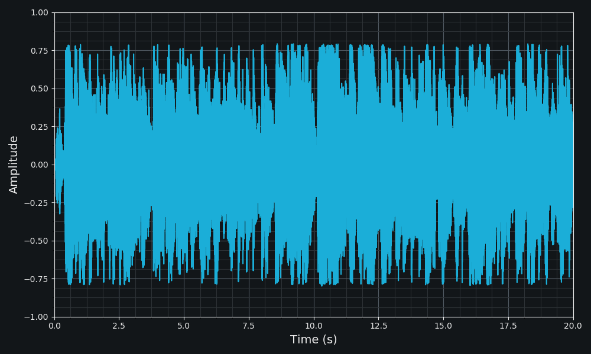
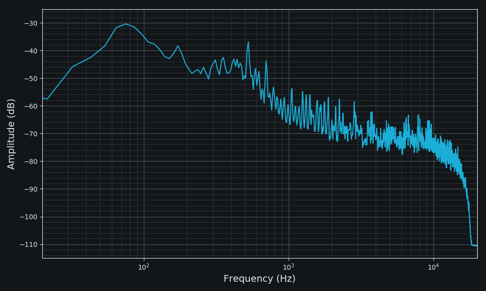
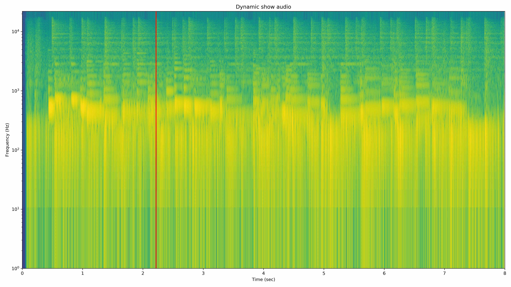
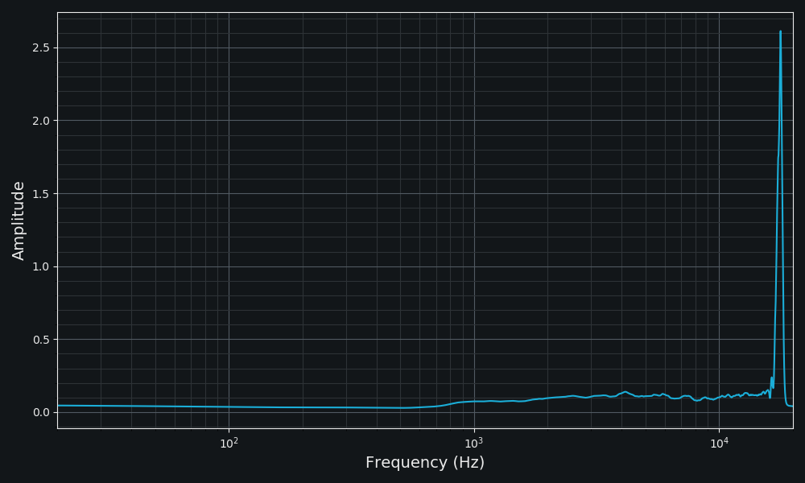

# python-audio-tools
A collection of audio tools in python.

## Usage
Please refer to [examples.py](/code/examples.py).

## Functions
### Display
* Waveform
  

  

* Spectrum
  

  

* Animate display

  

  

* Spectrum difference

  

### Transcoder
* FFmpeg control tools (wav, mp3, opus, vorbis-ogg, volume detection)
* Lame control tools (mp3)
* Opus control tools (opus)

## To do
### Effector
* EQ
* Limiter
* Compressor
* Delay
* Reverb

### Display
* Waveform(multichannel display supported)
* Spectrogram

### Analysis
* Volume
* Phase

### Audio comparison
* Volume difference
* Spectrum difference
* Alignment
